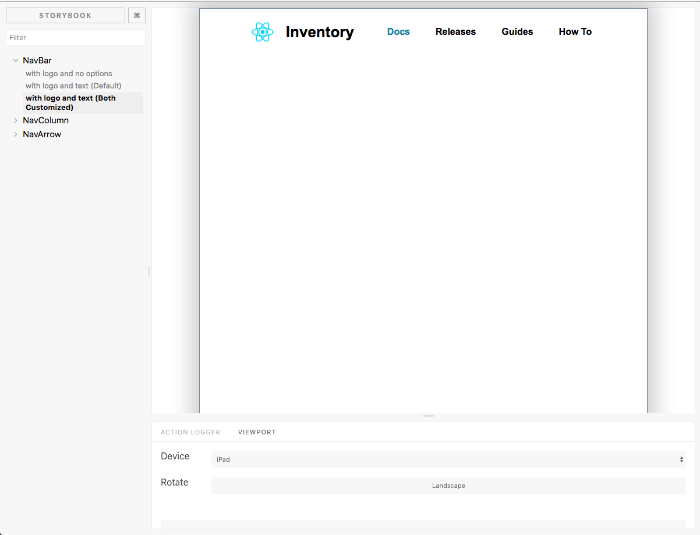

[][1]

## What is this?
Component Storybook, is a compendium of components, that can be used to test and showcase pieces the UI that make a crucial part of the web app business logic. I've even seen them being used to store UI Style Guide such as fonts & colors.

 

## Why this project?
During the writing of this project summary. UI Storybooks have been spoken of highly, in the Manchester JavaScript community. It promotes cross-collaboration between product owners, developers and designers on UI Development. 

As the tool helps keeps every member in the loop on component building progress; single source of component truth, that anyone in the team can access at anytime;comment on; request changes to ones that are up to spec, before they are fully utilised by the rest of the group.

 

## Main Aims
Test the:
- __Ease of Sharing & Collaboration__ - account and take note on how designs, developers, product owners are able to collaborate and use the Storybook.
- __Speed of Testing Components__ - not only can I unit tests these components, but more importantly I can visually change the state of UI components, showcase how each state can affected by user interactions.

 

## Development Approach
### Tool Selection
Requested Characteristics:
- Free - Open-source with a very large community backing is desirable
- Enable UI Component Testing
- Integrate well with the React Ecosystem

Final Decision to use, reasons behind each tool use:
- [Storybook.js][2] - Our main tool, enables the use of Storybook.js plugins; tools from setting different viewports; enabling more complex user actions such as drag and drop. Plus it integrates well with create-react-app, so very little setup is required
- [Jest (Test Runner + Assertion Library)][3] - there are a plethora of reasons, these are just a few
  - __Plug-In Play__ - comes with create-react-app, based on the Zero-configuration ethos, so no setup required here, start unit testing with a single command on the get go
  - __Fast__ - it's magnitudes faster than the traditional [Mocha][4], as it runs all tests in parallel (which Mocha doesn't).
  - __Batteries Included__ - comes with assertion functions; utility functions; snapshot testing, which captures state changes across component(s) over time, all out of the box
- [Enzyme (Test Utility)][5] - as Jest doesn't allow you to test the components the directly, this utility library enables simple interactions such as clicks, probing and altering of `state` and `props`, even the mocking of components.
- [Sinon (Test Utility)][6] - this utility library is JavaScript Test Runner Agnostics, I prefer using this over the `spy` and `mocking` capability that Jest offers. As Sinon's library is far more extensive - includes `mock`, `spy`, `stub` and `fake`. Another reason, is that I am more comfortable with using Sinon.js and see a reason to switch to any the Jest purposed `spy` features.

### Setup
As mentioned before very little setup is needed. There are no unusual deviations from the tutorial, as all tools integrates effortlessly with the React ecosystem.

### Workflow
1. Design - Style Guides, include a font ramp and color pallette
2. Design - design the individual Components, see [Design Approach][A] for a more in-depth summary
4. Development - create the initial skeleton of the component and import that component into the storybook
5. Development - Program the combination of states that are required for showcasing particular component aspects & behaviours
6. Repeat Steps 4 - 5 again for each component made
7. Then do then do the Unit testing for each component made.

 

## Design Approach

### Design Inspiration
Here I decided to clone the UI components from [GitBooks][7], in short an API library documentation tool. Rather than design my own bespoke components, it was much quicker way to test out the usefulness of a component library, by benchmarking it with components that already existed.

### Tool Selection
Characteristics Required
- Specialised UI Design Tool
- Graphics Design Tool

Both Tools below fit the bill quite nicely
- [Sketch][8]
- [Affinity][9]

Other design tools that aided full on team collaborations and UI product prototyping were not required here, such as the [Invisionapp][10] or [Marvelapp][11] ecosystems, as this was a personal project. That included micro interaction tools such [Principle][12] or [Flinto][13], because the design inspiration included GitBooks which did not have complex micro-interactions in some of its components - well the ones I was cloning anyway.

 

## Project Analysis
### Pros
- __Easy to Share Components__ - after I complete the storybook, all the components, their individual state/props undertest, can be built and showcased as a static site. This portability allows for simply sending a link on that specific component to another team member to take a look at.
- __Setup and Plugin Integration__ - I got started in less than 10 minutes of setting up, around an hour to see how all these tools integrated well with each other
- __Isolated Component Testing__ - seeing the individual state/prop changes help me to understand the behaviour of the component.

### Cons

- __Painful Testing__ - Instead of doing real Test Driven Development (TDD), where you would start by writing descriptive test spec, then move back and fourth from writing tests to developing the component. I decided to write the tests after the components were all completed.. Big mistake, not only did this take longer, but I would usually do double/triples takes on whether I
  - Missed an aspect/behaviour
  - Unsure on what needs to be tested, some of the time
- __Very Slow Development__ - I expected the project would take 1 - 2 weeks to complete. Instead it over 3 weeks, this was due to __NOT__:
  - Planning out aspects/behaviour to test - basically a unit testing plan
  - Documenting the aspects/behaviour of the cloned components
  - Unit Testing Properly

 

## Project Conclusion

Very slow development, kind of made me questions why I would want to use the storybook tool. Then again the technology here wasn't to blame, but it was how I used them, thus the slow development speed was due to:

1. Inexperienced with TDD
2. Workflow caused many mistakes along the way and double takes along the way
3. Insufficient Planning

### Simple Improvements
__Problem 1: Inexperienced with TDD__
  - Understanding what parts important enough to test. However I could test for everything, if the tests written and tests ran are very quick. It's usually best to go for close to 100% coverage as possible if it's cheap
  - Read up and throughly study on TDD best practices, especially practices related to JS and React Web Components

__Problem 2: Workflow caused many mistakes and double takes along the way__

Here I am going to apply a principle known as the [Hierarchy of Controls][14], used by the National Institute for Occupational Safety and Health (NIOSH) mitigate damage done by Hazards. However here it would the Hazards are more the potential mistakes made. The main focus here will be the __Adminstrative Controls__ part of the pyramid - changing the way I work essentially.

  - __Test First Heuristic__ - by specing out what needs to be tested first. Why? this allows for the majority of bases to be covered first, whereas if I was to write them after the components have been completed there is a greater chance of you missing or keeping track of what tests have been written. Plus a boredom problem usually seeps in, that makes keeping track of tests a lot of difficult.

  - __Go through the Entire Process First__ - this follows the Toyota Production System [Lean Manufacturing][15] where workers would pull an Andon cord whenever they find some flaw in the system, the process stops, the flaw is corrected. The same process should have been used for building components, where flaws can corrected there, reducing the number of mistakes and double takes for each component made.

### Bespoke Improvements
__Problem 3: Insufficient Planning__ 

Noting down a more in-depth and specific criteria, will not only allow us to have a clear understanding of what to do, but that includes a record of activities, deviations from the original documentations, so that a future analysis can be made overall performance.

  - __Mistake Accounting__ - Major mistakes made should be documented, so that they can be avoided/mitigated in the future. Why? mistakes can be expensive for any project, introduces a lingering inefficency that shouldn't be there
  - __Better Planning__ - an obvious rule thumb, is that at least having a bad plan is better than having no plan, as there is a structural basis to work off from. Using that logic having a good plan would stop me from making offhand assumptions and doing something willy-nilly
  - __More Steps Forwards, than Backwards__ - just having a record of what's been done, allows time to be set aside for analysing activities, to see if there can be any improvements can be implementated 

 

### Proposed New Workflow
Everything in __bold__ is are additions/edits made to the previous workflow. 

1. Design - Produce style guides, include a font ramp and color pallette
2. __Design - design a component__
3. __Development - start with writing tests that relate to it's behaviour__
4. Development - create the initial skeleton and import that component into the storybook
5. Development - Program the combination of states that are required for showcasing particular component aspects & behaviours
6. Development - Develop and manually test each component on it's UX
7. __Repeat Steps 2 - 6 again for each component made__

 

 

## Metadata
__Design Tools__

- Sketch 51
- Affinity 1.6.1

__Development Tools__

- React 16.4.1
- @Storybookjs/react 3.4.8
- Jest 20.0.4
- Enzyme 3.3.0
- Sinon 6.0.1

__Status:__ Completed

__Latest Update:__ 4th July 2018

__Latest Analysis:__ 31st July 2018

---

## Miscellaneous

[Component Storybook Project][1]

[GitHub][17]

[1]: https://gifted-lamport-5e30bc.netlify.com
[2]: https://storybook.js.org/
[3]: https://jestjs.io/
[4]: https://mochajs.org/
[5]: https://airbnb.io/enzyme/
[6]: http://sinonjs.org/
[7]: https://www.gitbook.com/
[8]: https://sketchapp.com/
[9]: https://affinity.serif.com/en-gb/designer/desktop/
[10]: https://www.invisionapp.com/
[11]: https://marvelapp.com/
[12]: https://www.flinto.com/
[13]: http://principleformac.com/
[14]: https://www.cdc.gov/niosh/topics/hierarchy/default.html
[15]: https://www.shmula.com/about-peter-abilla/what-is-andon-in-the-toyota-production-system/
[16]: https://github.com/anthonytranDev/component-storybook

[A]: #design-approach

[a]: /ux-ui/component-storybook