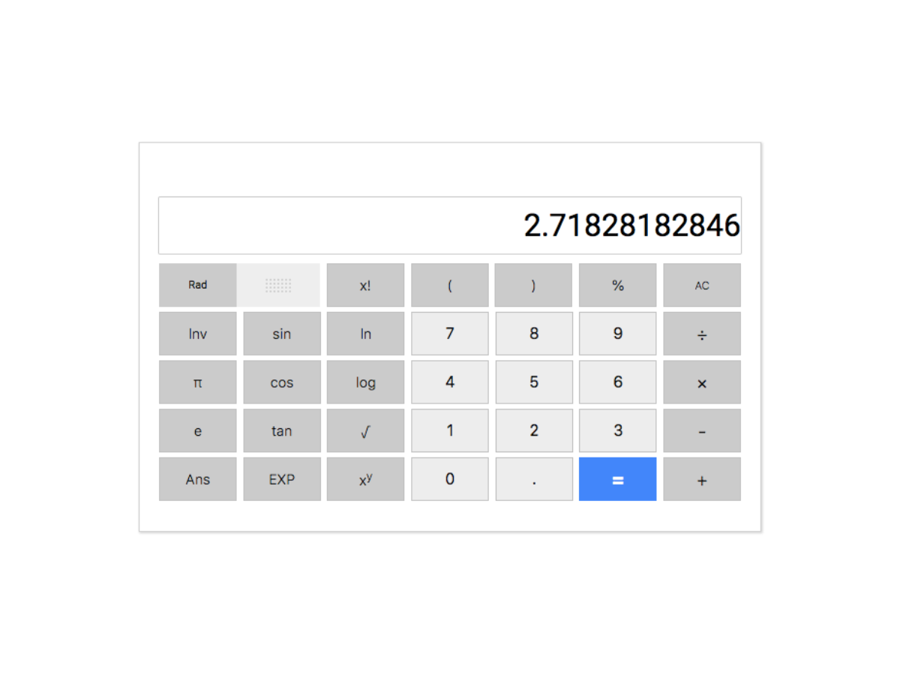

[][1]
<h5 style="font-weight: bold">[ Note: This project is NOT responsive, so do not view this on phone]</h5>

<br>

## What is this?
This application does what is says on the tin, well it should emulate the Google Calculator you can find when you search for calculator.

<br>

## Why this project?
Due to large level of complexity with application, it forced me to adopt the use of testing libraries such as `mocha` and `chai` to create this application. Unit testing here was new to me at the time, and one step forward in the app development could mean many steps backwards.

<br>

## Main Aims
Test with
- Mocha and Chai - This would be the first time I used a unit testing tool. The tests constantly ran throughout the project, the reason for this was the more I added complexity to each project, the chance of something breaking increased, as the final calculation had to run through a single function.

Develop
- Google Calculator - Emulate the feel and functionality of the application, the best I can
<br>

## Development Approach
If you want to find out the entire development process you can check out the links below
- [Plan][a]
- [Spec Sheet][b] - noted all expectations of the application
- [Activity Log][c] - notes I took throughout the entire project, more a way to analyse my activities in the future.

In short, the complexity of the project, resulted in a more trial and error basis to get answers that are the same or very close to that shown on the actual Google Calculator App.

__Complexity Explained__
- __Math Follows Predetermined Rules__ - all these rules must be ran in the right order, else you will end up with the wrong answer. This includes:
  - Follow BODMAS (Brackets, Order, Division, Multiplication, Addition and Subtraction); square root $\sqrt{x}$ and powers of $x^y$ as well
  - $f(x)$ - that includes $sin(x), cos(x), tan(x), ln(x), log(x)$
  - Transcendental numbers such as $π$, $e$
  - Others - factorials $!$ , percentages ${\%}$

- __Permutation of Calculations__ - so if you have read the [Spec Sheet][b], the test combinations could have amounted to $4096$, luckily I deduced that you could group the predetermined rules in terms of functionality, narrowing the previous number down to $64$. See below groups below:
  1. Convert all transcendental number to their numerical equivalent - well to a significant figure
  2. Start with calculation within in each bracket first
  3. Mathematical Functions - in the form of $f(x)$
  4. Factorial
  5. Percentages
  6. Arithmetic
  So here I gonna estimate about around $6! = 600$ test cases, which isn't that many. Please note that the test written were a lot less, as some were randomly generated; random test generation took longer than the application development itself; the test generator needed to be logically sound as the project heavily relied on it to get the correct answers.

- __Branching Features__- more specifically refering to settings you can toggle true or false; problem here is that every time you include a branch you increase the number of tests done $2^x$ for each separate application states - see below.
  - 1 Toggle Feature - $2^1 = 2$ application states
  - 2 Toogle Features - $2^2 = 4$  application states
  - 3 Toogle Features - $2^3 = 8$ application states
  The problem with this is that there were two toggles in this project, the `Inverse Toggle` and `Radians to Degrees Toggle`. I decided just to pick one, changing from Radian to Degrees, because it was the easier of the two. Plus the main exercise here was literally to test out my unit testing skills.

- __Rounding Problem__ - one of biggest issues I have with Google Calculator clone to this day, is that supposedly chooses to round numbers to assortment of decimal places. So I had to choose a way that best emulated the application


### Tools Used
- ES6 - includes the internal Math Object API
- Mocha & Chai

### Setup
Looking back now, the entire architecture was a bit of a mundane and disorganised. It was also all manually, it was back in the days where I haven't discovered boilerplate code.
Mundane - the dev and src file, were supposedly unorthodox
  - dev/ used as a src/ used in developer
  - src/ used a build/ directory. The transfer the dev/ -> src/ was done manually
  - utility functions was placed in the root
```
/dev
/src
|-- .babelrc
|-- .gitignore
|-- package.json
|-- utility.js
```

### Workflow
1. Build the UI, from scratch
2. Write a single feature at time 
3. Write all the test first. Tests written below
    - Basic Arithmetic
    - Individual functions + Constants
    - Power Index
    - 2 Combination of Features - random test generation
    - 3 Combination of Features - random test generation
    - 4 Combination of Features - random test generation
    - More specific combinations - manually written

<br>

## Design Approach
### Design Inspiration
Was simply to clone the Google Calculator; thus to use the actual application as a proxy for developing the design of the app

## Project Analysis
### Pros
- __Perform Accurate Calculations__ - across the 3 weeks the calculations and output values gradually became more optimised, as more tests were passed. This was mainly due to testing the entire app on a trial and error basis.
- __Random Tests Implemented__ - this was basically the crux of the project, if I got this right, then then I run an infinite number of tests, within a narrow range of combinations - in this case it was between 2 - 4 random feature combinations. With each test, small tweaks could made to improvement application, or test for edge cases

### Cons
- __Project is not maintainable__ - if I was included another future feature or 2, I estimate it would take longer than if I can redesign the entire app from scratch. As I would really know where to start, as the code braided and spaghettified.
- __Very Disorganised__ - comments, notes, even the artitecture on how the project is setup can slow down project development and give a unoptimsed build in the end
- __Not User Friendly__ - due to the tightly coupled, braided code, it was extremely difficult to change the user output for features such as:
  - Multiplication symbol `*` to $×$
  - Division symbol `\` to $÷$
  - Power values `10^2` to $10^2$
<br>

## Project Conclusion
Overall the project was a bit of success as I managed to complete over $90{\%}$ of the functionality, so the calculator is pretty usable... up to an extent. 

Still there are plethora of improvements to make, choosing them was based on the __Cons__ (previous section) as they were the most compelling flaws in the project per se; changes would need to be made, in order to improve both User and Developer Experience.
1. Project is not maintainable
2. Very Disorganised
3. Not User Friendly

### Simple Improvements
__2. Very Disorganised__ - in hindsight, here is a short list of simple organisation techniques
  - Stick to the *de facto* JavaScript project layout
    - Directories - `test/ src/ build/ /utils`
    - Documentation - `CHANGELOG, README`, DO NOT include other notes, leave outside the project. If it is a team project, store them in separate cloud based directory.
  - No Comments Please - keep them in separate docs as mentioned earlier
  - README should not contain an activity, only on how to use the project

__3. Not User Friendly__
  - __Spec User Expectation__ - pulling this from a 101 Agile style workflow. User stories can used to describe what user would expect from and make sure the design the app meets those expectations.

### Bespoke Improvement
More than a single step, usually less specific and more abstract way
__1. Project is not maintainable__
  - __Use React__ - here are reasons how a UI library like React can help
    - Re-usable Components - looking at the layout of the project, the feature button could developed once and reused over 10 times, saving precious time.
    - Store calculation string in State - 

## Metadata
__Development Tools__
  - ES6
  - Mocha and Chai

__Status:__ On-going

__Latest Update:__ 21th August 2017

__Latest Analysis:__ 2nd August 2018


## Miscellaneous

<a name="sum-of-combinations"></a>
__Sum of Combinations__

$$\Sigma_{k=1}^n \frac {n!}{k!(n - k)}$$

[Component Storybook Project][1]

[GitHub][2]

[1]: https://xenodochial-brahmagupta-22d130.netlify.com
[2]: https://github.com/anthonytranDev/Google_Calculator_App
[A]: #sum-of-combinations

[a]: /developer-projects/google-calculator/plan/
[b]: /developer-projects/google-calculator/spec/
[c]: /developer-projects/google-calculator/log/

- <a href="/developer-projects/google-calculator/plan/">Plan</a>
- <a href="/developer-projects/google-calculator/spec/">Spec Sheet</a> - noted all expectations of the application
- <a href="/developer-projects/google-calculator/log/">Activity Log</a> - notes I took throughout the entire project, more a way to analyse my 