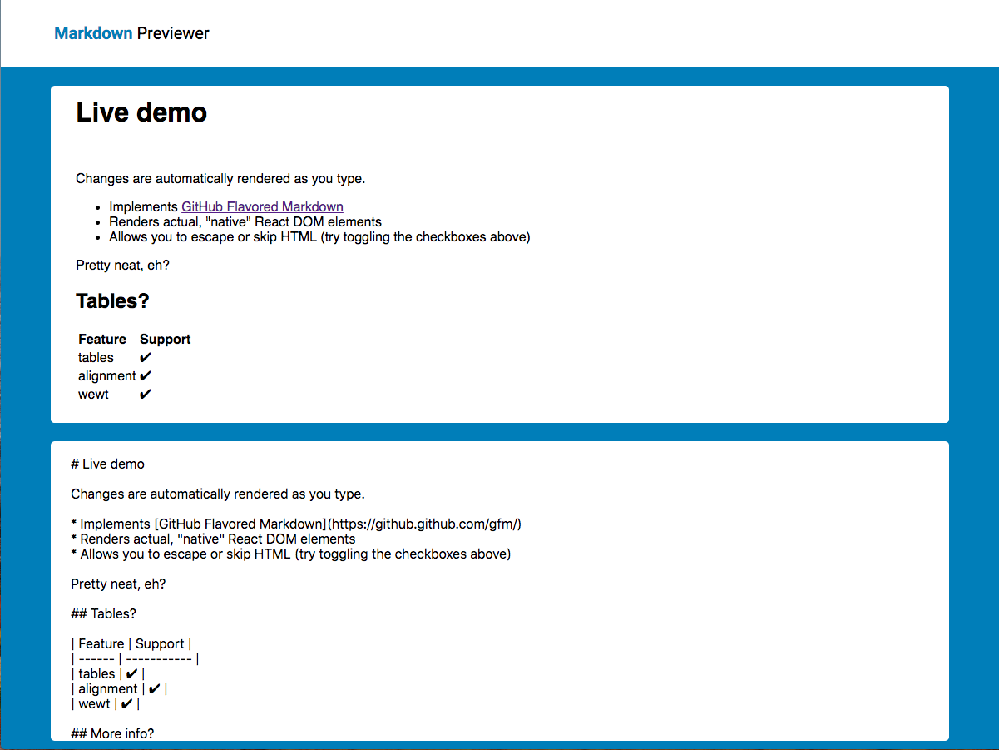

[][1]

<br>
<a name="why-this-project"></a>

## What is this?
This is my first project working with the new React 16.4 API, it's a way to understand the connection between state and props changes via inputs.

<br>

## Why this project?
This is beginner react project was required to understand 
- How the state is handled
- How props are handled
- How events can be handled
- Component lifecycle methods

<br>

## Main Aims
Successfully Develop
- A way for users to convert their Markdown to HTML text

Learn
- React Basics - see [Why this project?][A]

<br>


## Development Approach
In-depth analysis of:
  - Tools used
<a name="tools-used"></a>
  - Setup
  - Workflow

### Tools Used
- React 16.4.0
- React Markdown 3.3.2

As the main focus here was to complete the app and learn about React. I decided to use a useful library than create this all from scratch.

### Setup
Used `create-react-app` to set up the main app structure and downloaded the necessary packages - the ones from [Tools Used][B] Section

### Workflow
For this project, I didn't know where to start. However the project needed to have some kind of structure, to go for this simple architecture. All components in one directory, so that they are all one place.
```
/src
  |-- /component
  |    |-- FirstComponent.css
  |    |-- FirstComponent.js
  |    |-- SecondComponent.css
  |    |-- SecondComponent.js
  |
  |-- App.css
  |-- App.js
  |-- index.css
  |-- index.js
```
Another reason was to organise a component hierarchy
```
---
/index
---
/App
---
/components FirstComponent  SecondComponent
---
```

<br>

## Design Approach
### Design Inspiration
This one was simple, again the main focus was to learn React. So the design concept came from [jsonformatter][2]

<br>

## Project Analysis
### Pros
- __Learn Basic API__ - this is crucial in building a strong foundation. Here I learnt about the lifecycle
  - Lifecycle methods - in this order, constructor(), render(), componentDidMount()
  - state and props - get use to the React's unidirectional data flow

### Cons
- __Redundant Code ... a lot of it__ - you can find a lot of code that I can either remove or not use. This includes commmented out sections as well
  - propTypes - did need a type system for a small project like this, it is good practice, but here it isn't a neccesity
  - nesting div, article, section - I feel that some parts of the component could have been decomposed, to make the code more understandable and nicer 
  - commented out parts - this one is pretty obvious
  - `Component` in some parts not necessary - if I am rendering JSX, with no state, it's usually best to use function, rather than a class
- __Use CSS-to-JS library__ - could have used `emotion` to style my components, rather than css files, just to speed up development

<br>

## Project Conclusion
Looking back now, this was first React project. However this doesn't stop me being critical

1. Redundant Code
2. Modular CSS

### Simple Improvements
A single step or a small change that would have a dramatic effect on the project

__Modular CSS__
  - __Use Emotion__ - if the css is pretty complicated, 4 attributes or more, may even include additional logic or media query then Emotion.js is your best bet. You can return a function or use css syntax within a template string. Can make life a hell of a lot easier
  - __Use Inline Styles__ - On the other end of the spectrum if there is 1-3 attribute, just keep them inline. However please note that this overwrite the css you have written for the component

### Bespoke Improvement

__Redundant Code__
  - __Practice__ - use easier heuristics to make life easier, in terms managing code. Another tip is to commit small, often, to think that someone would read the code you commit. Can really save you from the embaressment

## Metadata
__Development Tools__
  - React 16.4.1
  - React Markdown 3.3.2

__Status:__ On-going

__Latest Update:__ 6th June 2019

__Latest Analysis:__ 2nd July 2018


## Miscellaneous

[Markdown Previewer Project][1]
[GitHub][2]

[1]: https://adoring-stonebraker-ab8c91.netlify.com
[2]: https://jsonformatter.curiousconcept.com
[3]: https://github.com/anthonytranDev/markdown-previewer

[A]: #why-this-project
[B]: #tools-used