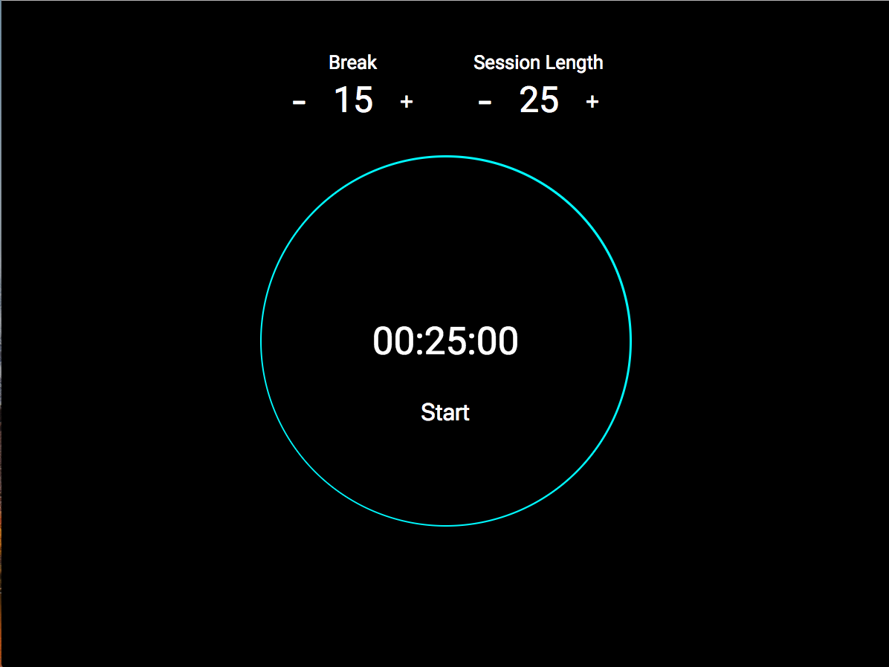

[][1]
<h5 style="font-weight: bold">[ Note: This project is NOT responsive, so do not view this on phone]</h5>
 

## What is this?
Pomodoro Clock is used as motivational timer. One session timer to time how long your work session, then a break timer for moments you want to stretch out your legs for a bit or grab a brew. Top that all, the look and feel of the web app, is based on Moto 360 ring look, for a more holistic feel.

 

## Why this project?
This allowed me to work with the WindowOrWorkerGlobalScope API, part of [HTML Living Standard][2]. Plus the project was quite complicated at the time, as I had no idea how to start

 

## Main Aims
- Mainability must be paramount

Develop
- A way to create a continous ring for a clock - was way harder than it looked at the time
- Toggle choosen time for user - whether it's reseting, pausing or changing the session or break time

 

## Development Approach
Again no idea where to start with this one, so I decided to map out a hierarchy of concepts for this one. Plus arrow functions were used here to organise the code in more predictable format, the same as any other programming languages. Rather using `function`, I now very rarely use function

This was the way I wanted to organise my code within that one file, reasons behind them; all in this order
1. __IIFE statement__ - starts at the very top, use as the settings configuration for the app, just in case I wanted to tweak the initial parts of the app 
2. __Declare all Global Constants__ - no need to search for them, if they are all in one place
3. __util functions__ - some way to translate seconds, to return what I denoted as a clock object - inspired by OOP
4. __app logic functions__ - included the `clock` acting as an object and functionality below this object
5. __Event Listener__ - last but not least, with any classic vanilla JS app, event handlers being declared last

 

## Design Approach (Optional)
### Design Inspiration
### Tool Selection
This was before how to design anything with Affinity, Sketch or even the open-source Inkscape for that matter

## Project Analysis
### Pros
- __Consistent Organisation__ - even looking back now, it took some advice fellow developer and careful consideration to make this app easier to develop for
- __Maintainable, in terms of VanillaJS__ - when writing this at the time, I was thinking a lot about future me. Whether I could this read it... Luckily my JS reading skills are better and yes it seems somewhat readable. If I'm being generous, quite mainable, as I know where to go, when I need to tweak something. However the code still needs a of improvement

### Cons
- __functions with a lot of arguments__ - if you have ever read ['Clean Code'][3] by Robert C. Martin
- __follow a pattern__ - peeking back at the code, it looks like some imitation of the flyweight pattern, which was I would have gone for. If I had known about design patterns existed and only wanted to use vanilla JS
- __Use a UI Library or framework__ - here either Vue.js or React.js would have able to sufficient to keep code more modular and individual logic separate

## Project Conclusion
One word __mainability__ . Follow by these words to describe what I mean by mainability.
  - Reduce Complexity - i.e. from Complex -> Simplex, by unbraiding the code
  - More consistency - following a pattern would have made it easier to recognise what part of the app is which
  - Modular - this can via a UI library or even using the export and require functions

1. Code needs to be more maintainable

### Bespoke Improvement
More than a single step, usually less specific and more abstract way
__1. Code needs to be more maintainable__

  - __Use React__ - storing the time as part of state, with clock being the component; incrementer, decrementer, pause and reset buttons being sub-component would have made it easier to organ individual parts. Even make template components, like toggle arrow and circle buttons be used by the sub-components, could be another step up.

## Metadata
__Development Tools__
  - ES6

__Status:__ Completed

__Latest Update:__ 28th September 2017

__Latest Analysis:__ 2nd July 2018

## Miscellaneous
[Pomodoro Clock][1]
[GitHub][4]

[1]: https://fervent-darwin-d1bb1c.netlify.com
[2]: https://html.spec.whatwg.org/multipage/timers-and-user-prompts.html#dom-settimeout
[3]: https://www.goodreads.com/book/show/3735293-clean-code
[4]: https://github.com/anthonytranDev/Pomodoro_Clock