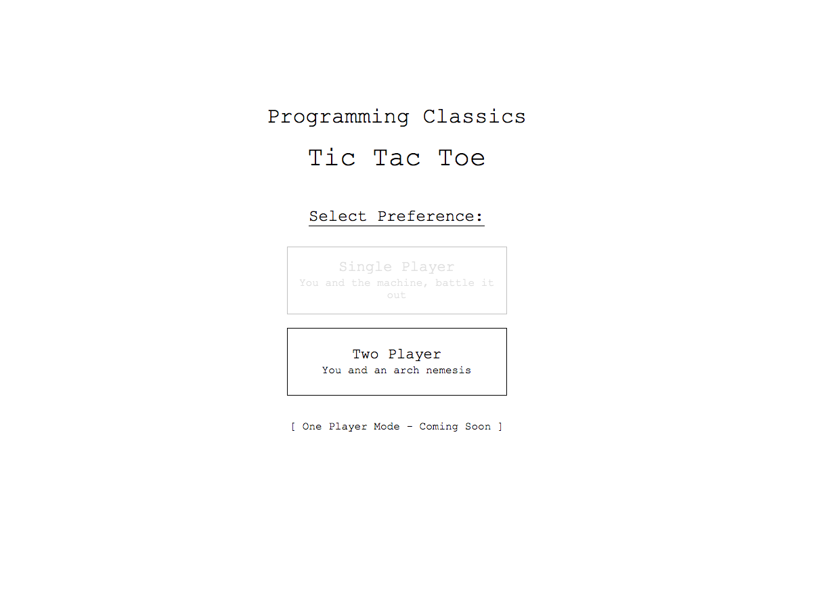

[][1]

<br>

## What is this?
We've all heard of this game and it's a programming classic. With a bit of twist, the game is given a 90's web gaming feel. With the current option of Two Player mode, and possible One Player Option in future version of the project.

<br>

## Why this project?

Even though I've already done this project in vanilla JavaScript, I wanted to understand the basics of the new React 16.4 API, try out the additional best practices the React Team have released. So this project will be more of a learning experience

<br>

## Main Aims
- __Learn how to program the Game in an asynchronous environment__
- __Successfully utilise the new React 16.4 API correctly__ - with functions such as Fragment, getDerivedStateFromProps and getSnapshotBeforeUpdate

<br>

## Development Approach
### Tools Used
- React 16.4.0

That's the main tool; the focus is on React 16.4 API.

### Setup
After using `create-react-app` for a quick project setup, I had to set up the basic architecture of the application first. Additional styling can be included as a simple `.css` file given the same name as the component. Components have there own directory; easier to locate where all the main components are in one places.
```
/src
  |-- /component
  |    |-- /Game
  |    |    |-- <Game-Component.js>
  |    |    |-- <Game-Component.css>
  |    |-- /Menu
  |         |-- <Menu-Component.js>
  |         |-- <Menu-Component.css>
  |-- App.css
  |-- App.js
  |-- index.css
  |-- index.js
```

### Workflow
1. Both the sections of the app, Menu and Game can be conceptually be split up; both are mutually exclusive; development can be done independently of the other.
2. Menu and Game components the programming pattern was closely based on functional decomposition, however in some cases it was far easier to visualise the responsibility of the sub-component and build it separately in the same file. When the time came to use the component again, it can be decoupled from the original file and imported in as a separate component.

```
  // before decomposition
  import React, { Component } from 'react'
  import Squares from './Squares'
  class Game extends Component {
    ...
    render(){
      return 
        <div>
          { Array(9).map(x => <Squares /> ) }
        </div>
    }
  }
```

<br>

```
  // after decomposition
  import React, { Component } from 'react'
  import Squares from './Squares'
  const Board = () => {
    return Array(9).map(x => <Squares /> )
  }

  class Game extends Component {
    ...
    render(){
      return < Board />
    }
  }
```

3. During the decoupling of the component, the CSS can be decoupled from the original main-component

```
  // before decoupling
  |-- Game.js
  |-- Game.css  14kB
  |-- Scoreboard.js

  // after decoupling
  |-- Game.js
  |-- Game.css  10kB
  |-- Scoreboard.js
  |-- Scoreboard.css 4kB
```
4. Once all components are there own separate entities, you can then start to move state up and props down within the component the hierarchy. This is due to the architecture of the app I wanted, where state was all managed in one place - this would make future maintainance of the app easier. Plus as react has uni-directional data flow, it makes the app data management highly predictable

<br>

## Design Approach
### Design Inspiration
I wanted to go for something minimalistic and nostalgic, plus on the off occasion I've poked fun of soviet-era website design in the past. So in the end, I went for a ye old gaming look. That consisted of 
- Retro
- Monospace text
- Monochromatic color scheme
- Separation of element using only __thin lines__ and a lot of __whitespace__, to give it a more premium look

### Tool Selection
- Sketch 51

I only need a basic UI to be designed, no additional graphics required.

## Project Analysis
### Pros
I learnt the basics of:
- __React's Asynchronous API__ - the biggest challenge here was to coordinate each component to act synchronously, as some parts of the apps had to run before others. For instance a user action needed to update the square component, then a function would need to check whether the player had won. All in that order, the solution I found out later on was to keep all state changes to be within the top component, this made it easier to manage the entire application state.
- __Functional Decomposition__ - one of the problems I have noticed with my previous apps, was that the components gradually became very large and unwieldly. To make this application more manageable, I had to apply the Single Responsibility and Abstraction principles.

```
  // Before
  Game

  // After
  Game
  ---
  Board, Dialog, Scoreboard, RefreshButton
  ---
  Square
```

### Cons
- __Didn't utilise entire React 16.4 API__ - this may seem kinda of reasonable as some parts of the API wasn't needed at the time. Still it was a bit of a shame, I would have got a chance to test out circumstances where specific functions would have been quite useful. More a pet peeve that didn't improvement my understanding of `getDerivedStateFromProps` and `getSnapshotBeforeUpdate`
- __Complex State Changes__ - if you check out Game component, there are many long hard to read functions, because they are responsible for changing a large portion of the application state. Here the `Redux` library could have been used to organise actions and state changes - due to it's Single source of truth state tree.

- __Redundant Code__ - need to a bit careful, with this one and remove the `console.log` functions a bit of rookie mistake here

<br>

## Project Conclusion
The project was a success, as I was able to get the project working despite of the asynchronous problems at the beginning. Where each component would interact out of the sync. This solution was simple as keeping all the major state changes in one component... however I don't like this current solution, as the code doesn't look clean.

1. Complex State Changes
2. Redundant Code

### Simple Improvements
__2. Redundant Code__

Best way to avoid this is to flag a `warning` as part of ESLint, whenever `console.log` is present in the code. Besides console.log shouldn't used here at all, as VS code provides debugging capabilities with React and Chrome, via a Chrome VSCode package plugin.

__Additional Improvements__
Looking back at this project, I could speed up component development process by decoupling the component at the start. Development them separate.
Use a CSS-in-JS library such as emotion.js.

`Emotion.js` benefits over libraries `glam`, `glamor`, `styled-components` and `glamorous`.

- Support media queries - `styled-component` does not support this
- Utilise CSS looking syntax, in same file as component - no need for CSS, done via template literal
- Include JS inside the using __ES6 template literals__ or __objects__ to represent your css
- Works with any library - so if there were to change to another framework
- Most importantly, it has a predictable composition

A single step or a small change that would have a dramatic effect on the project

### Bespoke Improvement
__1. Complex State Changes__

There is this famous quote made by Dan Abramov "Don't use Redux until you have problems with vanilla React". One of the characteristics of the library is that it offers a single source of truth. To allows for state changes to this source through what are known as `actions` and `reducers`.

<br>

## Metadata
__Design Tools__
  - Sketch 51

__Development Tools__
  - React 16.4.0

__Status:__ On-going

__Latest Update:__ 10th June 2018

__Latest Analysis:__ 31st July 2018


## Miscellaneous
<a name="miscellaneous"></a>

[Tic Tac Toe Project][1]
[Async Rendering Blog][2]
[GitHub][3]

[1]: https://adoring-swartz-b59a60.netlify.com
[2]: https://reactjs.org/blog/2018/03/27/update-on-async-rendering.html
[3]: https://github.com/anthonytranDev/tic-tac-toe

[A]: #miscellaneous