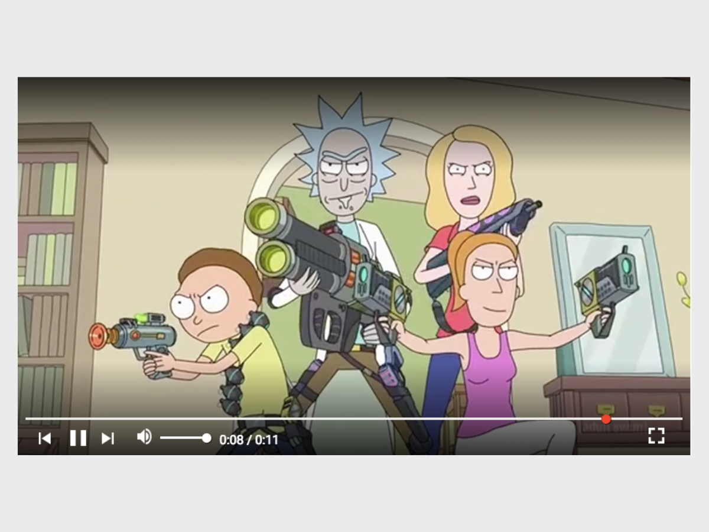

[][1]

<br>

## What is this?
This is my attempt to clone the Youtube media player, this includes all it's features.

<br>

## Why this project?
I wanted to understand JavaScript development in the past and how it lead to developers adoption of ES6 module style of today, which made the common.js and AMD application build become obselete. So I decided to delve into JavaScript development history and use Require.js to build the YouTube Video media player.

<center><h4 style="margin-bottom: 5px">"Not to know what has been transacted in former times is to be always a child. If no use is made of the labors of past ages"</h4></center>
<center>[ Marcus Tullius Cicero ]</center>

<br>

## Main Aims
Learn:
- How to utilise RequireJS
- How to utilise the ES6 Promise API

Build:
- A YouTube media player that can closely emulates user experience; that includes all of its functionality

<br>

## Development Approach
What made this pretty difficulty was dedicing how I should structure the application - these were the days where I haven't discovered "Best Practices". So a lot of time was spent reading the require.js documentation, before planning ahead. Which looking back now is always the right move to make.

### Tools Used
- Sass
- ES6
- Require.js

### Setup
Here is the architecture I needed to create a require.js application. There are some changes made to make future navigation easier.

```
/
|-- index.html
|-- /assets
|-- /js
|    |-- \app
|    |-- \utils
|    |-- app.js
|    |-- require.js
|
|-- /stylesheets
|    |-- /css
|    |    |-- app.css
|    |    |-- other-stylesheets.css
|    |
|    |-- /scss
|         |-- app.scss
|         |-- other-stylesheets.scss
```
<h5><b>Figure 1: Entire App Architecture Above</b></h5>

__Notable Features__
- `require.js` - to take full advantage of the optimisation tool, only reference require.js as the only script file in the index.html
- `app.js` - contains all the app logic
- `app.scss` - where all the sass stylesheet imported into and converted into app.css and included as a link in `index.html`


### Workflow
These were the days before I built any application using UI-libraries, so through applying the SRP I kept all languages apart and included them in the final index.html file.
1. Run node-sass in the background to continously post-process `.scss` to `.css` files
2. Build UI look in the `index.html` - quite unheard of nowadays with `.vue` and `.jsx` files for component based development
3. When Building
    - Keep all main app logic in `app.js`
    - Keep all utility files in `/util`. These files were made up of:
      - `constant.js` - references to the document in
      - `state.js` - all state in one place
      - `action.js` - user actions
4. Rinse and repeat 2 - 3 per UI feature

<br>

## Design Approach
### Design Inspiration
Used the actual YouTube media player as a proxy and copied the look and feel from the app directly

<br>

## Project Analysis
### Pros
- __More Modular Code__ - it's possible to organise an application utilising the Single Responsibility Principle per file, which allowed the app to be far more maintainable than if I had kept all the Vanilla JS in a single file - compared to my previous project on the [Google Calculator App][a]


### Cons
- __Did not Build the project__ - during the development of the app, I didn't know the differences between an app in development and app in production. Which meant I didn't take full advantage of the RequireJS Optimiser in the end
- __Media Player Development was unsuccessful__ - this was quite unfortunate, as I wanted to clone every individual feature the media player had. However whenever I have successfully completed a UI feature, the previous one would usually break. Eventually the app started to regress so much so, it cause to abandon the project altogether after some frustration.

## Project Conclusion
As mentioned earlier the project was not a success, nevertheless the main idea here isn't to dwell on past mistakes, but to learn from them and grow. Below discusses the solution that I am confident would work with skill and experience I have now.

1. Did not Build the project
2. Media Player Development was unsuccessful

### Bespoke Improvement
More than a single step, usually less specific and more abstract way
__1. Did not Build the project__
  - __Web App Bundler__ - I decided that `ParcelJS` would be a good pick here over browsify and webpack, it's zero-configuration and it's slight flexibility allows me to set up a way to bundle ES6 project out of box with a single command. Plus I don't need to configure for the build process, again all done with a single command, makes building less of a hassle.
  - __Use latest ECMAScript features__ - 
    - `import` and `export` statements, although not natively supported by node 10, enables far easier organisation of modules, compared to RequireJS
    - `async` and `await` for asynchronous user events

__2. Media Player Development was unsuccessful__
  - __Introduce Testing__ - follow the 10/20/70 rule of thumb from Google "10% Acceptance", "20% Integration" and "70% Unit" Testing, to reduce regressions I recommend `Cypress` for Acceptance and `Jest` for Integration and Unit Testing

## Metadata
__Development Tools__
  - RequireJS - via CDN 2.3.5
  - ES6
  - node-sass 4.5.3

__Status:__ Completed

__Latest Update:__ 23rd October 2017

__Latest Analysis:__ 3rd August 2018


## Miscellaneous

[Component Storybook Project][1]

[GitHub][2]

[1]: https://thirsty-panini-0e27d1.netlify.com/
[2]: https://github.com/anthonytranDev/youtube_video_player_clone

[a]: /developer-projects/google-calculator
