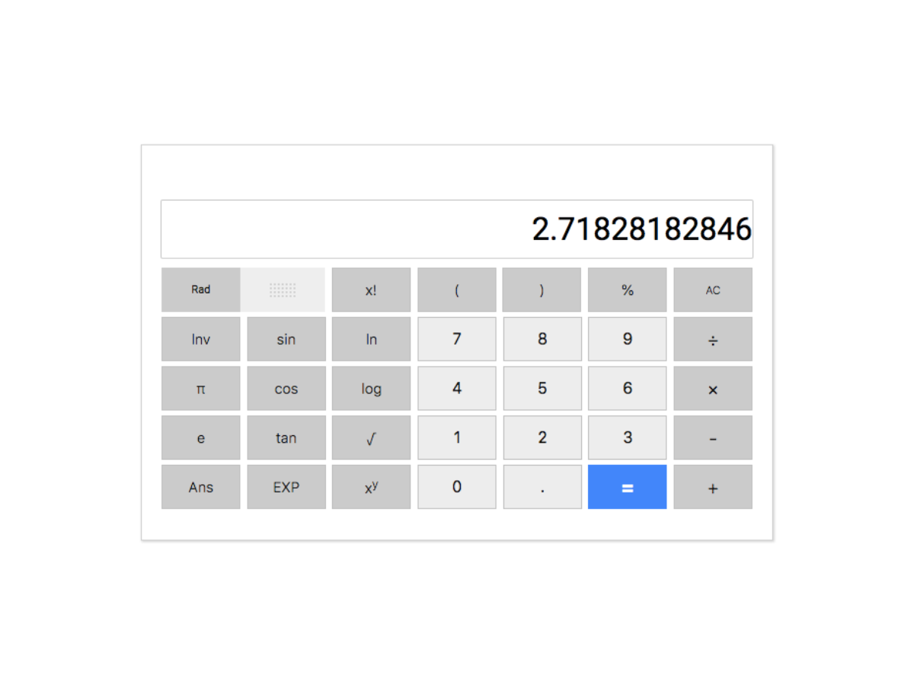

## Development Approach
Reverse Engineering - a lot of time spent manually tinkering with the actually Google calculator - the one you get from googling 'calculator'. Key aspects such as mathematical precision, infinite values were noted, to mimic the apps behaviours.

## Development Analysis
### Pros
- TDD - Constantly leverage the use of Mocha, Chai to test whether the mathematical values",
- App behaviour closely matches the actual app
- Plug-n-play JS app, you click on the HTML file and instantly get access to the app."

### Cons
- "Code quality is poor, as the entire app is built monolithically; complex and needs unbraiding",
- "No coding pattern or libraries to make the app development easier to build or more manageable
- "Functional Programming; immutability "

## Metadata
### Tools used
- Babel - preset to ES2015
- Mocha - JS test runner
- chai - JS assertion library

__Completion Date:__ 28th September 2017E