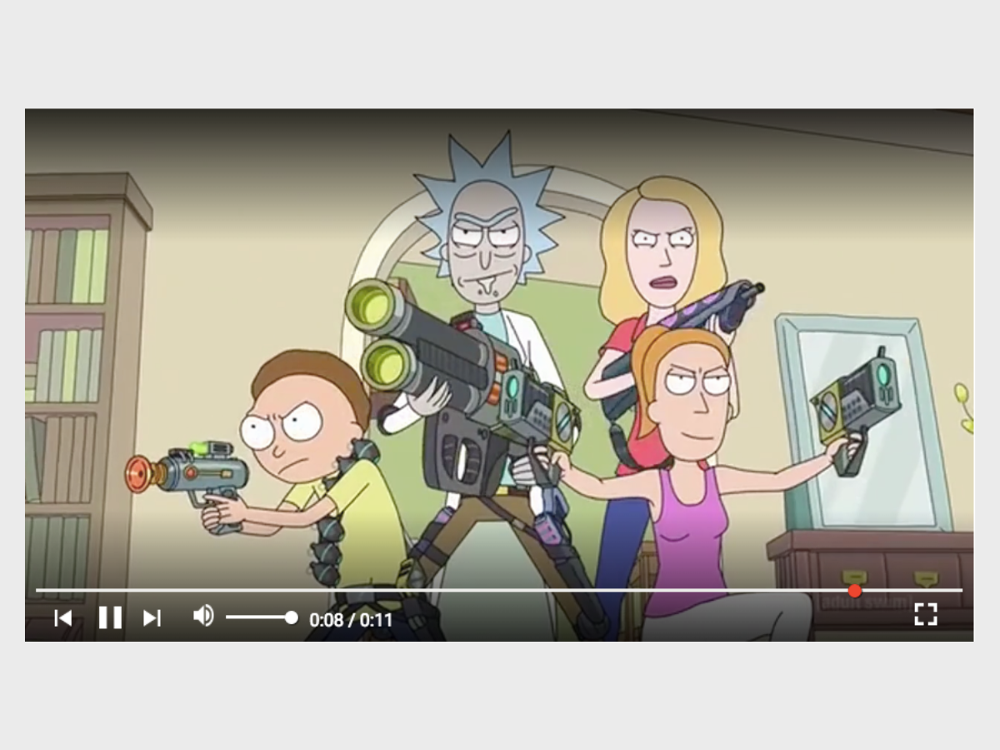

[][1]

## Development Approach
Reverse Engineering - The main video player build was separated from the 'Interactive Design Side' then combined later on. As it was important to get the functionality of the app right first before moving onto the design side focusing on UX.

## Development Analysis
### Pros
- TDD - Constantly leverage the use of Mocha, Chai to test whether the mathematical values",
- App behaviour closely matches the actual app
- Plug-n-play JS app, you click on the HTML file and instantly get access to the app."

### Cons
- "Code quality is poor, as the entire app is built monolithically; complex and needs unbraiding",
- "No coding pattern or libraries to make the app development easier to build or more manageable
- "Functional Programming; immutability "

## Metadata
### Tools used
- Babel - preset to ES2015
- Mocha - JS test runner
- chai - JS assertion library

__Completion Date:__ 28th September 2017E

[1]: https://github.com/anthonytranDev/youtube_video_player_clone.git