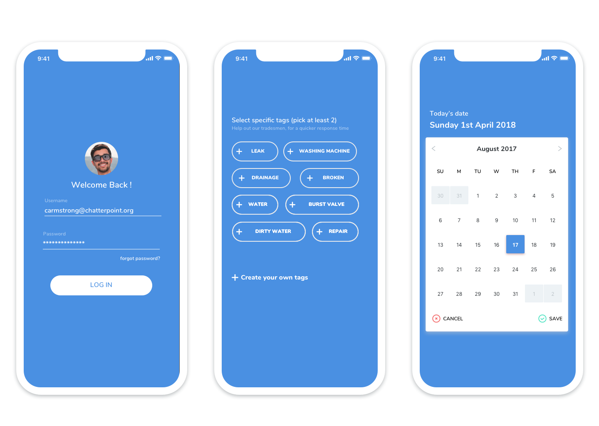
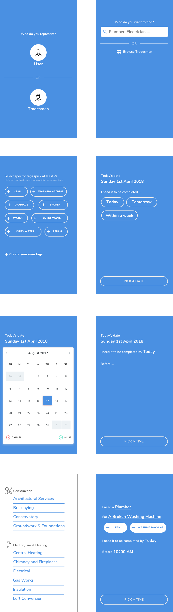
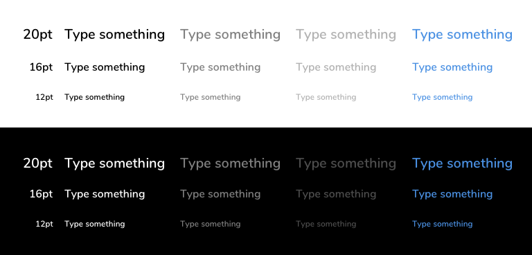
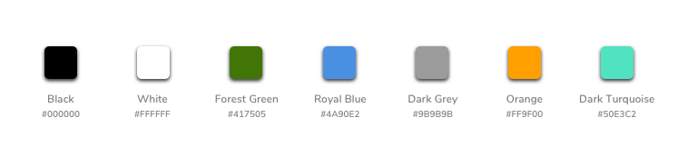
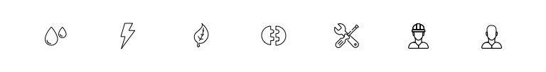

## Product Aims
__Target Consumers__ - women aged between 18 - 40

From this we derived global characteristics, that we wanted the design theme to follow

- Simple
- Friendly - quote, not intimidating to any user

 

 

## Design Specs
### Type Ramp

__Fonts Used:__ Nunito Semi Bold, Nunito Bold

#### Why Nunito ?
Nunito is very friendly, readable and can pack text into tight spaces - useful for a lot of texts on apps.

Decided to go for a singular font, as no other aspect of the design required high contrasting of typefaces. With the added bonus of no *sacrifice* on text consistency.

### Color Palette

Went for the calming __Forest Green__ and __Royal Blue__ colours, the blue color to match the company logo.

__Orange__ and __Dark Turquoise__ were used a contrast, for actionable elements, such as the Turquoise confirm button when picking a date 

 

### Iconography

The clean thin line designed icons gives the app, a more expensive feel, which ties in with the app development for iOS before Android. 

Smooth Border radii are much preferred to give each item a friendly feel

 

## Design Inspiration

For additional information please check out

- [Mood Board]()
- [Not Board]() - the opposite of a mood board, specific design elements the designer should avoid.

__Completion Date:__ Was never completed, after the startup was disbanded